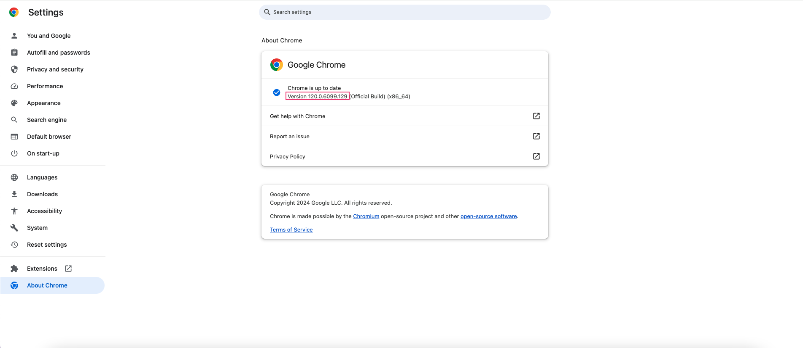

# jjwxc-downloader 晉江文學城小說下載器
A Python script to download free chapters of a novel from jjwxc. It is used for educational purposes only. Please do not use it for commercial purposes. The script supports txt and epub format. The epub format provides good reading experience with book covers, an organized outline, and easy readability on e-book devices.

這是一個用於從晉江文學城下載小說免費章節的Python腳本，僅供教育目的使用。請勿將其用於商業目的。腳本支援txt和epub格式。epub格式提供了書籍封面、組織良好的大綱以及在電子書設備上輕鬆閱讀的優越閱讀體驗。

## Prerequisite
- Google Chrome
- ChromeDriver (same version as Google Chrome)

You may check the version of Google Chrome in the Settings.



Download the correct ChromeDriver at https://chromedriver.chromium.org/downloads/version-selection. Additionally, you can check for the latest version of ChromeDriver at https://googlechromelabs.github.io/chrome-for-testing.

After downloading the zip file for ChromeDriver, unzip it and place the chromedriver executable in the same folder as the jjwxc-downloader script.
```plaintext
jjwxc-downloader/
├─ jjwxc.py
├─ chromedriver
```

## Change log
### 2024-01-08 
**Added**
- download book cover
- convert .txt to .epub
- contain bookcover, outlines and metadata in .epub

## How to run
1. Install the dependencies
```plaintext
pip3 install -r requirements.txt
```
2. Download book in .txt format and .epub format and book cover
```plaintext
python3 jjwxc-epub.py 
```
or

Download book in .txt format only and book cover
```plaintext
python3 jjwxc.py
```
3. Enter the novelid you want to download

## Note
Each chapter name begins with ##. This is for later convenience, such as adding indexes when converting the txt to epub.


## Future work
1. Add conversion from txt to epub ✅
2. Add GUI for editing metadata of the epub

Please add issue if you need any assistance.
